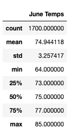
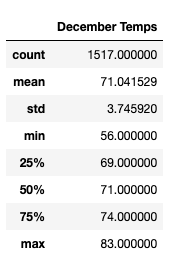
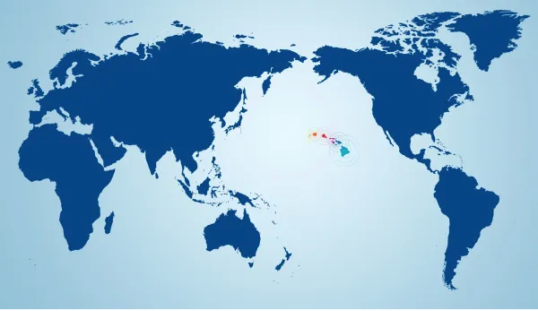

# surfs_up

## Overview of the Analysis

The following analysis, along with the accompanying business proposal, will help to illustrate the potential sales and opportunities for a Surfboard and Shake Shop in Oahu.

### Purpose

In addition to the detailed business proposal, a number of data was collected to provide a more refined picture of overall weather conditions experienced over mulitple years for the island of Oahu. In order to project approximate sales and customer interactions, an analysis of annual weather patterns was conducted.

## Results 
 
- June Temperatures:
    * This table shows a gorgeous and consistent temperature for the month of June over multiple years. Businesses report high tourist counts and strong engagement to support the need for an additional surfboard provider with the additional offering of shakes.

- December Temperatures:
    * This table shows that while there are potential cold swings during the winter months, the average is near the same as June temperatures. This finding is encouraging for the potential of a year-round stand that does not have to endure the seasonal schedule of less desirable island destinations.
    

- Hawaii on the Map:
    * The central placement of Hawaii allows for a more consistent and less dramatic swing in weather conditions. This is a positive placement.
    

## Summary

- Will weather affect the ability of the business to be successful? 

    * There is a high emphasis on outdoor lifestyle and activities throughout all Hawaiian islands. With a consistent temperature throughout the calendar year, there should not be any extended period of time where conditions are not ideal for surfing and shake enjoyment.
    
- Are there dramatic differences between "Summer" and "Winter" months in Oahu?

    * After looking at a multi-year view of temperature in both June and December, there does not look to be a severe increase or decrease of temperature correlated to the month of the year.
        
    * Looking to the future, it would be advantageous to run the same analysis on the remaining islands of Hawaii. These will be utilized when a multi-island expansion seems reasonable and financially solvent.